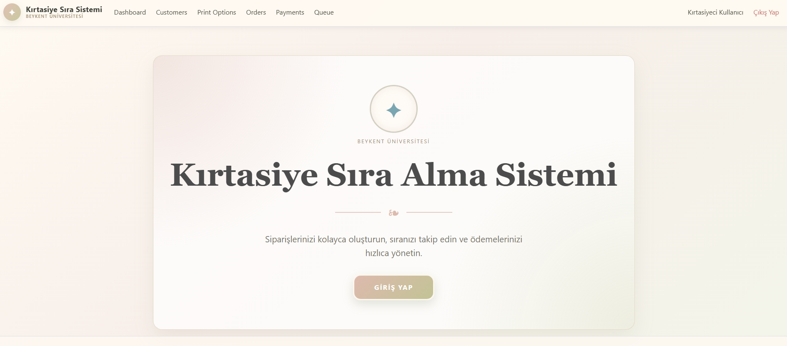
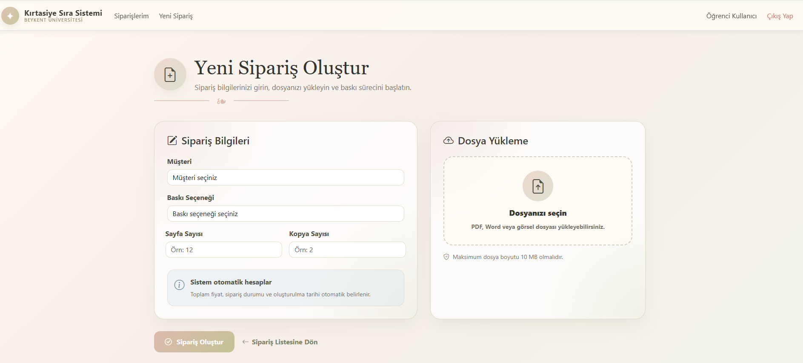
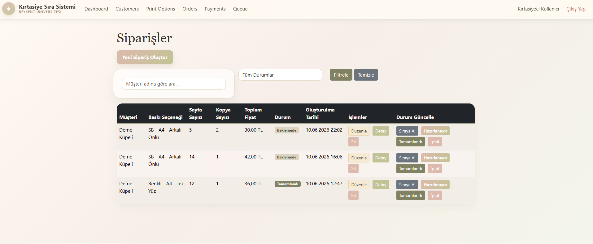
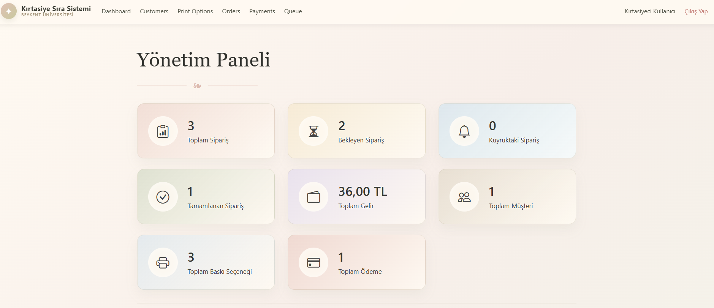
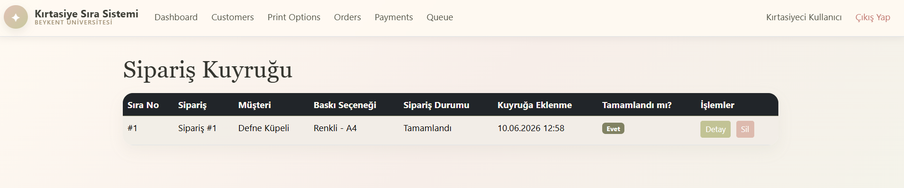

# SmartStationerySystem

SmartStationerySystem, öğrencilerin baskı siparişi oluşturabildiği ve kırtasiyecilerin sipariş, ödeme ve sıra süreçlerini yönetebildiği ASP.NET Core MVC tabanlı bir web uygulamasıdır.

Uygulama; müşteri yönetimi, baskı seçenekleri, sipariş oluşturma, dosya yükleme, sipariş durumu güncelleme, ödeme takibi ve sipariş kuyruğu gibi işlemleri tek bir sistemde birleştirir.

## Özellikler

* Öğrenci ve kırtasiyeci rollerine göre giriş ve yönlendirme
* Müşteri kayıt, güncelleme, silme ve listeleme işlemleri
* Baskı seçeneklerinin yönetimi

  * Renkli / siyah-beyaz baskı
  * Kağıt boyutu
  * Tek yön / çift yön baskı
  * Sayfa başı fiyat bilgisi
* Sipariş oluşturma ve otomatik toplam fiyat hesaplama
* PDF, Word ve görsel dosyası yükleme desteği
* Sipariş durumu yönetimi

  * Beklemede
  * Sırada
  * Hazırlanıyor
  * Tamamlandı
  * İptal Edildi
* Siparişlerin müşteri adına ve durumuna göre filtrelenmesi
* Sipariş durumuna göre otomatik kuyruk oluşturma
* Ödeme kayıtlarının yönetimi
* Kırtasiyeci için sipariş, gelir ve müşteri bilgilerini içeren dashboard ekranı

## Kullanılan Teknolojiler

* ASP.NET Core MVC
* .NET 9
* Entity Framework Core
* Microsoft SQL Server LocalDB
* Razor Views
* Bootstrap
* HTML, CSS ve JavaScript

## Ekran Görüntüleri

### Giriş Ekranı



### Yeni Sipariş Oluşturma



### Sipariş Yönetimi



### Kırtasiyeci Dashboard'u



### Sipariş Kuyruğu



## Proje Yapısı

```text
SmartStationerySystem/
│
├── Controllers/        # MVC controller sınıfları
├── Data/               # ApplicationDbContext ve veritabanı bağlantısı
├── Models/             # Entity modelleri
├── Migrations/         # Entity Framework migration dosyaları
├── Views/              # Razor kullanıcı arayüzleri
├── wwwroot/            # CSS, JavaScript ve yüklenen dosyalar
├── Program.cs          # Uygulama başlangıç ve servis yapılandırmaları
├── appsettings.json    # Veritabanı bağlantı ayarları
└── SmartStationerySystem.csproj
```

## Veri Modeli

Sistem aşağıdaki temel varlıkları içerir:

* `AppUser`: Kullanıcı ve rol bilgileri
* `Customer`: Müşteri bilgileri
* `PrintOption`: Baskı türü, kağıt boyutu, çift taraflı baskı ve fiyat bilgileri
* `Order`: Sipariş detayları, toplam fiyat ve durum bilgisi
* `UploadedFile`: Siparişe eklenen belge veya görsel dosyaları
* `QueueItem`: Sıraya alınan siparişler
* `Payment`: Ödeme tutarı, yöntemi ve ödeme durumu

## Nasıl Çalıştırılır?

### Gereksinimler

Bilgisayarınızda aşağıdaki araçların kurulu olması gerekir:

* .NET 9 SDK
* SQL Server LocalDB
* Visual Studio veya Visual Studio Code
* Entity Framework Core CLI

### 1. Projeyi Klonlayın

```bash
git clone <REPO_URL>
cd SmartStationerySystem
```

### 2. Bağımlılıkları Yükleyin

```bash
dotnet restore
```

### 3. EF Core Komutu Tanınmıyorsa Kurun

```bash
dotnet tool install --global dotnet-ef --version 9.0.8
```

### 4. Veritabanını Oluşturun

Proje, SQL Server LocalDB kullanır. Bağlantı ayarı `appsettings.json` dosyasında bulunmaktadır.

```bash
dotnet ef database update
```

Bu komut migration dosyalarını kullanarak `SmartStationeryDb` veritabanını oluşturur.

### 5. Uygulamayı Başlatın

```bash
dotnet run
```

Terminalde görünen `https://localhost:...` veya `http://localhost:...` adresini tarayıcıda açın.

## Demo Kullanıcıları

Uygulama ilk çalıştırıldığında aşağıdaki örnek kullanıcılar otomatik olarak eklenir:

| Rol         | E-posta                                             | Şifre  |
| ----------- | --------------------------------------------------- | ------ |
| Öğrenci     | [ogrenci@mail.com](mailto:ogrenci@mail.com)         | 123456 |
| Kırtasiyeci | [kirtasiyeci@mail.com](mailto:kirtasiyeci@mail.com) | 123456 |

## Sipariş Akışı

1. Kırtasiyeci önce müşteri ve baskı seçeneklerini ekler.
2. Öğrenci veya kullanıcı yeni sipariş oluşturur.
3. Baskı seçeneği, sayfa sayısı ve kopya sayısına göre toplam ücret otomatik hesaplanır.
4. İsteğe bağlı olarak PDF, Word veya görsel dosyası yüklenir.
5. Sipariş başlangıçta **Beklemede** durumunda oluşturulur.
6. Kırtasiyeci siparişi sıraya alabilir, hazırlamaya başlayabilir veya tamamlayabilir.
7. Sipariş “Sırada” durumuna geldiğinde kuyruk kaydı otomatik oluşturulur.
8. Ödeme işlemleri ödeme ekranından takip edilir.

## Not

Bu proje eğitim amaçlı geliştirilmiştir. Demo kullanıcı parolaları örnek kullanım içindir. Gerçek bir ortamda ASP.NET Core Identity, parola hashleme, yetkilendirme kontrolleri ve ek güvenlik önlemleri uygulanmalıdır.
